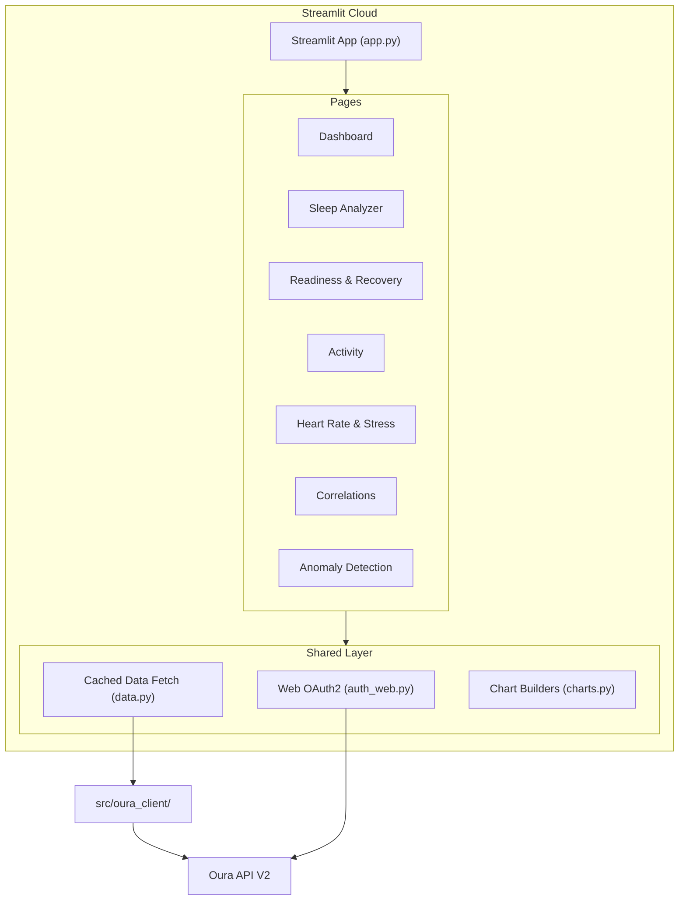

# Streamlit Health Dashboard

> Implementation plan for the multi-page Streamlit web app.
> **Status: Completed**

## Architecture

The app builds on the existing `src/oura_client/` library (client, models, auth). A multi-page Streamlit application lives in `apps/dashboard/` with web-based OAuth2 authentication, deployable to Streamlit Community Cloud directly from GitHub.



### Why Streamlit

The existing project is Python-based with Plotly charts. Streamlit natively supports Plotly, has built-in caching (`@st.cache_data`), multi-page navigation (`st.navigation`), session state for token storage, and deploys for free on Streamlit Community Cloud. The pyproject.toml lists `streamlit>=1.30` as an optional dependency.

### OAuth2 for Web (vs. Local Server)

The existing `auth.py` uses a local HTTP server callback which won't work in a hosted environment. The `auth_web.py` module implements a web-friendly OAuth2 flow:

1. User clicks "Connect to Oura" -- Streamlit redirects to Oura's `/oauth/authorize`
2. After consent, Oura redirects back to the app URL with `?code=...`
3. Streamlit detects the code via `st.query_params`, exchanges it for tokens
4. Tokens are stored in `st.session_state` for the session duration

## File Structure

```
apps/dashboard/
  app.py                       # Entry point: auth gate + page routing
  pages/
    1_dashboard.py             # Holistic health overview
    2_sleep.py                 # Sleep Quality Analyzer
    3_readiness.py             # Readiness Forecast + Workout Recovery Advisor
    4_activity.py              # Activity trends & goals
    5_heart_rate_stress.py     # HR time-series + Stress/Recovery balance
    6_correlations.py          # Cross-metric Correlations Engine
    7_anomalies.py             # Health Anomaly Detector
  components/
    auth_web.py                # Web-based OAuth2 flow using st.query_params
    data.py                    # @st.cache_data wrappers around OuraClient
    charts.py                  # Reusable Plotly chart-building functions
  .streamlit/
    config.toml                # Server config + dark theme
```

## Page-by-Page Design

### app.py -- Entry Point

- Check `st.session_state` for an access token
- If no token, check `st.query_params` for an OAuth `code` and exchange it
- If still no token, show a "Connect to Oura" login screen
- If authenticated, render `st.navigation()` with all 7 pages
- Sidebar: date range picker (shared across all pages), user info, logout button

### Page 1: Dashboard (Holistic Overview)

- Top row: big-number KPIs for today (sleep score, readiness score, activity score, stress summary, SpO2)
- Second row: 7-day sparkline trends for each metric
- Bottom: calendar heatmap of readiness over the past 30 days
- Implements the **Holistic Health Dashboard** idea

### Page 2: Sleep Analyzer

- Sleep architecture stacked bar chart (deep/light/REM/awake per night)
- HRV trend line during sleep over time, with rolling average overlay
- Sleep efficiency scatter plot (bubble size = total sleep, color = latency)
- Sleep phase timeline for a selected night (using `sleep_phase_5_min`)
- Flag nights below configurable thresholds (efficiency < 80%, latency > 30min)
- Implements the **Sleep Quality Analyzer** idea

### Page 3: Readiness & Recovery

- Readiness score trend with stacked contributor breakdown (HRV balance, body temp, sleep balance, etc.)
- "Weakest link" analysis: identify which contributor drags score down most over a period
- Workout list with next-day readiness delta
- Recovery time estimation: show readiness trajectory after hard workouts
- Implements both **Readiness Forecast** and **Workout Recovery Advisor** ideas

### Page 4: Activity

- Daily steps bar chart with target line
- Active calories vs total calories
- High/medium/low activity time breakdown
- Equivalent walking distance trend
- Sedentary time tracking

### Page 5: Heart Rate & Stress

- Intraday HR scatter colored by source (rest, awake, sleep, workout)
- Resting HR trend (from sleep periods) with rolling average
- Daily stress vs recovery minutes (grouped bars)
- Stress summary pie chart (restored/normal/stressful distribution)
- Resilience level timeline

### Page 6: Correlations Engine

- Select any two metrics (sleep score, readiness, activity score, steps, HRV, stress, etc.)
- Scatter plot with OLS trendline and R-squared
- Correlation matrix heatmap across all daily metrics
- Time-lagged correlations (e.g., "does today's workout affect tomorrow's readiness?")

### Page 7: Anomaly Detection

- Rolling z-score on temperature deviation, HRV, SpO2, resting HR
- Flag days where any metric exceeds 2 standard deviations from its 14-day rolling mean
- Timeline view with highlighted anomaly windows
- Potential illness early-warning (rising temp + declining HRV)

## Shared Components

### components/auth_web.py

- `get_auth_url()` -- build Oura OAuth2 authorization URL with the app URL as redirect
- `handle_callback()` -- check `st.query_params` for `code`, exchange for tokens
- `is_authenticated()` -- check session state for valid token
- `show_login_page()` -- render login screen with "Connect to Oura" button + sandbox fallback
- Tokens stored in `st.session_state["access_token"]` and `st.session_state["refresh_token"]`

### components/data.py

- `@st.cache_data(ttl=300)` wrappers for every OuraClient method
- `get_all_daily_data(token, start, end)` -- fetches sleep, activity, readiness, stress, resilience, spo2, cardiovascular age and returns a merged DataFrame keyed by `day`
- `get_sleep_df(token, start, end)` -- fetches detailed Sleep records as DataFrame
- `get_heart_rate_df(token, start_dt, end_dt)` -- fetches HR time series as DataFrame

### components/charts.py

- `score_kpi(label, value, delta)` -- renders a big-number metric with delta
- `sparkline(values)` -- minimal line chart for KPI trends
- `sleep_architecture_chart(df)` -- stacked bar chart
- `trend_line(df, x, y, title)` -- line chart with rolling average
- `correlation_matrix(df)` -- heatmap of pairwise correlations
- `anomaly_timeline(df, metric, window, threshold)` -- line chart with z-score bands
- `calendar_heatmap(df, date_col, value_col)` -- week-by-week scatter heatmap

## Deployment

Deploy on [Streamlit Community Cloud](https://streamlit.io/cloud) directly from GitHub:

1. Push repo to GitHub
2. Connect at [share.streamlit.io](https://share.streamlit.io)
3. Select repo, branch `main`, file `apps/dashboard/app.py`
4. Add secrets: `OURA_CLIENT_ID`, `OURA_CLIENT_SECRET`, `OURA_REDIRECT_URI`
5. Register the redirect URI at the [Oura Developer Portal](https://developer.ouraring.com/applications)

### Streamlit Cloud Secrets

Configured in the Streamlit Cloud UI (not committed to the repo):

- `OURA_CLIENT_ID`
- `OURA_CLIENT_SECRET`
- `OURA_REDIRECT_URI` (set to `https://your-app-name.streamlit.app/`)

## Sandbox/Demo Mode

A toggle in the sidebar enables "sandbox data (demo mode)". When active, the app uses `OuraClient(sandbox=True)` which hits Oura's `/v2/sandbox/...` endpoints returning mock data. This lets anyone explore the app without connecting a real Oura ring.
