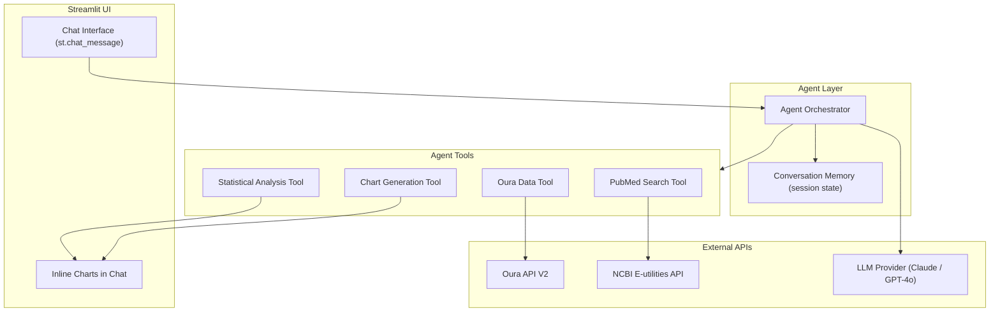

# AI Health Assistant -- Implementation Plan

## Overview

An AI-powered conversational assistant embedded in the Streamlit dashboard that can analyze Oura health data, retrieve relevant biomedical research from PubMed, and provide personalized insights and recommendations. The assistant operates as an agent with access to tools for data retrieval, statistical analysis, and literature search.

## Architecture



## LLM Provider

Support both Anthropic (Claude) and OpenAI (GPT-4o), configurable via environment variable:

- `AI_PROVIDER=anthropic` or `AI_PROVIDER=openai`
- `ANTHROPIC_API_KEY` / `OPENAI_API_KEY` set accordingly
- Default to Anthropic Claude for its strong performance on nuanced health reasoning and long-context analysis

Both providers support tool/function calling, which is essential for the agent architecture.

## Agent Tools

The assistant has access to 4 tools it can invoke during conversations:

### 1. Oura Data Tool

Wraps the existing `OuraClient` to fetch and summarize health data on demand.

**Capabilities:**
- Fetch any data type for a date range (sleep, readiness, activity, stress, HR, etc.)
- Compute summary statistics (averages, trends, min/max)
- Compare two time periods ("how did my sleep change this week vs last week?")
- Identify patterns ("which nights did I sleep best?")

**Implementation:** A thin wrapper around `src/oura_client/client.py` that the LLM calls via tool-use. Returns structured data that the LLM interprets for the user.

### 2. PubMed Search Tool

Queries NCBI's E-utilities API to find relevant biomedical research.

**Capabilities:**
- Search PubMed for articles related to a health topic (e.g., "HRV and sleep quality")
- Return article titles, abstracts, authors, publication dates, and PMIDs
- Filter by date range, article type (review, clinical trial, meta-analysis)
- Fetch full abstracts for top results

**Implementation:** Uses the NCBI E-utilities REST API directly via `httpx`:
- `esearch.fcgi` to search and get PMIDs
- `efetch.fcgi` to retrieve article details in XML
- `elink.fcgi` to find related articles
- Requires: `tool` name and `email` parameters (NCBI policy)
- Optional `NCBI_API_KEY` for higher rate limits (10 req/sec vs 3 req/sec)

**Example queries the LLM might generate:**
- "HRV variability sleep quality recovery" (when user asks about HRV trends)
- "SpO2 nocturnal desaturation health implications" (when SpO2 anomalies detected)
- "body temperature deviation illness prediction wearable" (when temp anomaly flagged)

### 3. Statistical Analysis Tool

Performs on-the-fly statistical computations on Oura data.

**Capabilities:**
- Correlation analysis between any two metrics
- Time-lagged cross-correlation
- Rolling statistics (mean, std, z-scores)
- Trend detection (slope of linear fit)
- Distribution analysis (percentiles, normality test)

**Implementation:** Uses `pandas`, `numpy`, and `scipy.stats` directly. The LLM describes the analysis to perform, the tool executes it, and returns the results as structured data.

### 4. Chart Generation Tool

Creates inline Plotly charts within the chat conversation.

**Capabilities:**
- Generate any chart type (line, bar, scatter, heatmap) from data
- Annotate charts with insights
- Compare metrics side-by-side

**Implementation:** Uses the existing `components/charts.py` builders. Returns a Plotly figure that gets rendered inline in the chat via `st.plotly_chart()`.

## File Structure

New files within the dashboard app:

```
apps/dashboard/
  pages/
    8_assistant.py              # Chat page UI
  components/
    agent/
      __init__.py
      orchestrator.py           # Main agent loop: prompt -> tool calls -> response
      providers.py              # LLM provider abstraction (Anthropic + OpenAI)
      tools.py                  # Tool definitions and implementations
      pubmed.py                 # PubMed/NCBI E-utilities client
      prompts.py                # System prompts and tool descriptions
      memory.py                 # Conversation history management
```

## Agent Orchestrator Design

The orchestrator implements a simple tool-use loop:

```
1. User sends message
2. Append to conversation history
3. Send history + system prompt + tool definitions to LLM
4. If LLM responds with tool calls:
   a. Execute each tool call
   b. Append tool results to history
   c. Send updated history back to LLM (go to step 3)
5. If LLM responds with text: display to user
6. If LLM responds with text + chart: display both
```

This is a standard ReAct-style loop. No framework (LangChain, etc.) is needed -- the orchestrator is ~150 lines using the Anthropic/OpenAI SDKs directly, keeping dependencies minimal and the code transparent.

## System Prompt

The system prompt establishes the assistant's role:

```
You are a health data analyst assistant with access to the user's Oura Ring data.
You can:
- Fetch and analyze their sleep, activity, readiness, stress, heart rate, and other health metrics
- Search PubMed for relevant biomedical research to support your analysis
- Perform statistical analysis (correlations, trends, anomaly detection)
- Generate charts to visualize findings

Guidelines:
- Always ground insights in the user's actual data -- don't speculate without evidence
- When making health observations, cite relevant research from PubMed
- Present findings clearly, noting limitations of wearable sensor data
- You are NOT a doctor. Frame suggestions as informational, not medical advice
- Include a disclaimer when discussing health conditions
```

## Example Conversations

### Sleep Analysis
**User:** "Why has my sleep been bad this week?"
**Assistant:**
1. Calls Oura Data Tool: fetch sleep data for this week + previous week
2. Compares metrics: efficiency dropped 12%, latency increased 15 min, deep sleep down 20%
3. Calls PubMed Tool: "sleep latency increase causes lifestyle"
4. Responds with data summary, trend chart, and cites research on common factors (screen time, caffeine, stress)

### Health Anomaly Investigation
**User:** "My temperature has been elevated for 3 days. Should I be worried?"
**Assistant:**
1. Calls Oura Data Tool: fetch temperature deviation, HRV, and SpO2 for past 14 days
2. Calls Analysis Tool: compute z-scores, check if HRV is also declining
3. Calls PubMed Tool: "body temperature elevation HRV decrease illness prediction wearable"
4. Responds with data, notes that temp + declining HRV can precede illness, cites studies, suggests monitoring

### Workout Optimization
**User:** "When is the best time for me to do intense workouts?"
**Assistant:**
1. Calls Oura Data Tool: fetch workouts, next-day readiness/stress for past 3 months
2. Calls Analysis Tool: correlate workout timing with recovery outcomes
3. Calls PubMed Tool: "optimal exercise timing circadian rhythm recovery"
4. Responds with personalized analysis + research context

## PubMed Client Details

The PubMed client (`components/agent/pubmed.py`) wraps NCBI E-utilities:

**Base URL:** `https://eutils.ncbi.nlm.nih.gov/entrez/eutils/`

**Endpoints used:**
- `esearch.fcgi?db=pubmed&term=QUERY&retmax=10&retmode=json` -- search
- `efetch.fcgi?db=pubmed&id=PMID1,PMID2&retmode=xml` -- fetch details
- `esummary.fcgi?db=pubmed&id=PMID1,PMID2&retmode=json` -- summaries

**Rate limits:** 3 req/sec without API key, 10 req/sec with `NCBI_API_KEY`

**Response parsing:** XML responses parsed with Python's `xml.etree.ElementTree` (stdlib, no extra dependency).

## Dependencies

New dependencies to add:

```
anthropic>=0.40        # Anthropic Claude SDK
openai>=1.50           # OpenAI SDK
```

All in Python. No other languages needed. XML parsing uses stdlib.

## Deployment (Streamlit Community Cloud)

The AI assistant works on Streamlit Community Cloud with these secrets:
- `AI_PROVIDER` -- `anthropic` or `openai`
- `ANTHROPIC_API_KEY` or `OPENAI_API_KEY`
- `NCBI_API_KEY` (optional, for higher PubMed rate limits)
- Existing Oura OAuth secrets

## Implementation Phases

### Phase 1: Core Agent (2-3 days)
- LLM provider abstraction (Anthropic + OpenAI)
- Agent orchestrator with tool-use loop
- Oura Data Tool integration
- Chat UI page in Streamlit

### Phase 2: PubMed Integration (1-2 days)
- PubMed E-utilities client
- PubMed Search Tool for the agent
- Citation formatting in responses

### Phase 3: Analysis & Charts (1-2 days)
- Statistical Analysis Tool
- Chart Generation Tool (inline in chat)
- Conversation memory optimization

### Phase 4: Polish (1 day)
- System prompt refinement
- Error handling and rate limit management
- Health disclaimer handling
- Testing with realistic queries
